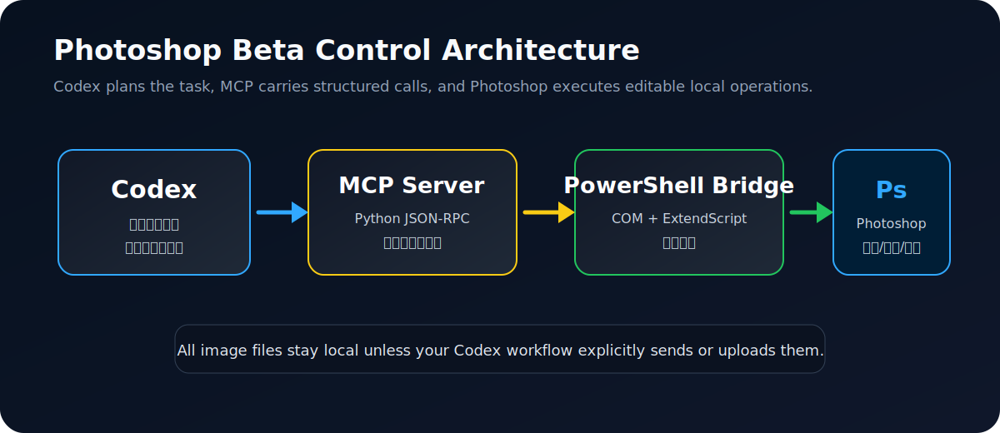
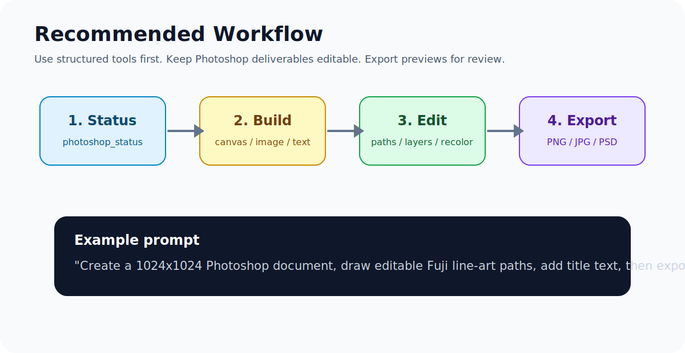

# Photoshop Beta Control

让 Codex 通过本地 MCP 插件控制 Windows 上的 Adobe Photoshop / Photoshop Beta，完成图片打开、画布创建、图层编辑、可编辑路径绘制、质感换色、批量导出等真实办公和设计自动化任务。

> 这是本地自动化桥接工具，不是 Adobe 官方插件。它依赖 Photoshop 的 Windows COM 自动化能力和 ExtendScript。



## 能做什么

- 检查本机 Photoshop 状态、当前文档尺寸、分辨率和模式。
- 打开本地图片，新建指定尺寸画布。
- 放置图片为新图层，设置位置、尺寸、透明度和混合模式。
- 添加可继续编辑的文字图层。
- 创建可编辑 Photoshop 路径，并可用当前画笔描边成可见线稿层。
- 列出、选择、重命名、隐藏、删除图层，设置透明度和混合模式。
- 进行常见图片处理：裁切、缩放、亮度、对比度、锐化、导出。
- 进行更自然的局部换色：用多边形蒙版保留纹理、褶皱、高光和阴影。
- 执行批处理工作流，一次完成“新建画布 -> 放图 -> 加字 -> 导出”等操作。
- 在结构化工具不够时运行自定义 JSX。

## 工具矩阵

| 工具 | 用途 |
| --- | --- |
| `photoshop_status` | 查看 Photoshop 是否可用、当前文档信息 |
| `photoshop_find_progids` | 查找本机注册的 Photoshop COM ProgID |
| `photoshop_open_image` | 打开本地图片 |
| `photoshop_create_document` | 新建画布 |
| `photoshop_place_image` | 放置图片为新图层 |
| `photoshop_add_text_layer` | 添加可编辑文字层 |
| `photoshop_layer_ops` | 列出/选择/重命名/隐藏/删除/调整图层 |
| `photoshop_draw_paths` | 创建可编辑路径，可选描边 |
| `photoshop_adjust_image` | 裁切、缩放、亮度、对比度、锐化、导出 |
| `photoshop_texture_recolor` | 局部真实换色，保留纹理 |
| `photoshop_apply_overlay` | 精确放置透明叠加层 |
| `photoshop_export_active` | 导出当前文档 |
| `photoshop_batch` | 顺序执行多个工具步骤 |
| `photoshop_run_jsx` | 运行自定义 Photoshop ExtendScript |

## 安装到 Codex

### 1. 克隆项目

```powershell
cd $env:USERPROFILE\.codex\plugins
git clone https://github.com/kiki348/photoshop-beta-control.git
```

也可以把本目录复制到任意 Codex 可加载的本地插件目录。

### 2. 确认 Photoshop COM 可用

打开 Photoshop 或 Photoshop Beta，然后在 PowerShell 中运行：

```powershell
cd $env:USERPROFILE\.codex\plugins\photoshop-beta-control
powershell -NoProfile -ExecutionPolicy Bypass -File .\scripts\photoshop_bridge.ps1 -Action find_progids
```

如果默认 ProgID 无法连接，可以在启动 Codex 前设置：

```powershell
$env:PHOTOSHOP_PROG_ID = "Photoshop.Application"
```

常见候选值包括：

- `Photoshop.Application`
- `Photoshop.Application.2026`
- `Photoshop.Application.2025`
- `Photoshop.Application.BETA`
- `Photoshop.Application.Beta`

### 3. 在 Codex 中启用插件

Codex 识别插件根目录下的 `.codex-plugin/plugin.json` 和 `.mcp.json`。安装后重新打开 Codex，或在插件管理界面选择本地插件。

如果你维护自己的 marketplace，可以参考：

```json
{
  "name": "photoshop-beta-control",
  "source": {
    "source": "local",
    "path": "./plugins/photoshop-beta-control"
  },
  "policy": {
    "installation": "AVAILABLE",
    "authentication": "ON_INSTALL"
  },
  "category": "Productivity"
}
```

## 怎么让 Codex 操作 Photoshop

先告诉 Codex 你要它使用 Photoshop 控制能力，例如：

```text
用 Photoshop 新建一个 1024x1024 白底画布，画一幅富士山线稿。要求线条后续能编辑，最后导出 PNG。
```

Codex 应该先调用 `photoshop_status`，确认 Photoshop 可用，然后组合 `photoshop_create_document`、`photoshop_draw_paths`、`photoshop_export_active` 等工具。

更偏办公批量处理的例子：

```text
打开这个产品图，把它放到 1920x1080 画布中央，加上可编辑标题“新品上市”，导出一张 JPG 和一份 PSD。
```

更偏修图的例子：

```text
把当前 PS 文档里发饰区域换成深红色，但保留布料纹理和高光，不要做成一块死红。
```

这类任务应优先使用 `photoshop_texture_recolor`，而不是简单覆盖色块。

## 示例批处理

`examples/social-post.batch.json` 展示了一个可复用流程：

1. 新建 1920x1080 画布。
2. 放置产品图。
3. 添加可编辑中文标题。
4. 导出 JPG。

`examples/editable-line-art.paths.json` 展示了如何用点数据创建可编辑路径线稿。

## 自定义扩展

推荐从这几个位置扩展：

- `scripts/mcp_server.py`：添加新的 MCP 工具 schema、参数校验、批处理逻辑。
- `scripts/photoshop_bridge.ps1`：添加新的 PowerShell action，并生成对应 JSX。
- `skills/photoshop-control/SKILL.md`：告诉 Codex 什么时候该优先使用新工具，而不是直接写 JSX。
- `examples/`：沉淀可复制的工作流。

扩展原则：

- 能结构化就不要直接让 Codex 写长 JSX。
- 对可逆/可编辑任务，优先创建新图层、文字层、路径或 PSD，而不是直接破坏原图。
- 对局部换色，优先保留原始纹理和光影。
- 对批量办公任务，把步骤封装进 `photoshop_batch`，方便复用。



## 隐私

插件只在本机运行，通过本机 PowerShell 调用 Photoshop COM 和 ExtendScript。它不会主动上传图片、PSD、浏览器数据或账号信息。你让 Codex 处理的本地文件仍然会被当前 Codex 会话读取和写入，请按自己的数据安全要求使用。

## 局限

- 仅支持 Windows。
- 依赖 Photoshop/Photoshop Beta 的 COM 注册状态。
- Adobe 新版本可能改变 COM ProgID 或 ExtendScript 行为。
- `photoshop_draw_paths` 创建的是 Photoshop 路径对象；如果选择 `stroke: true`，可见墨迹层是普通像素层，路径本身仍可编辑。
- 复杂选择、生成式填充、滤镜参数等能力可能仍需要 `photoshop_run_jsx` 或人工确认。

## License

MIT
